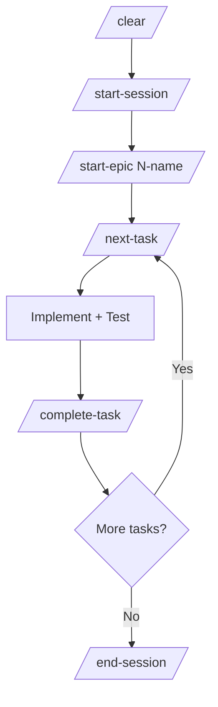
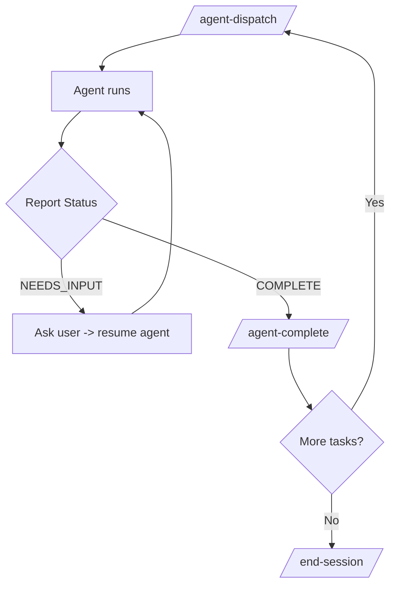
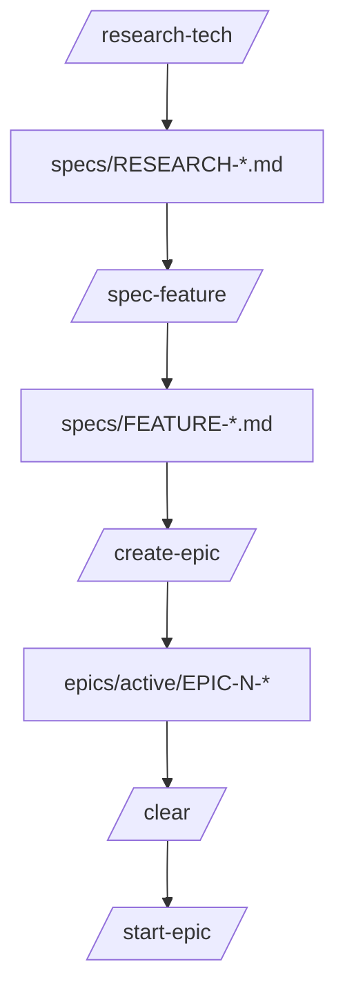
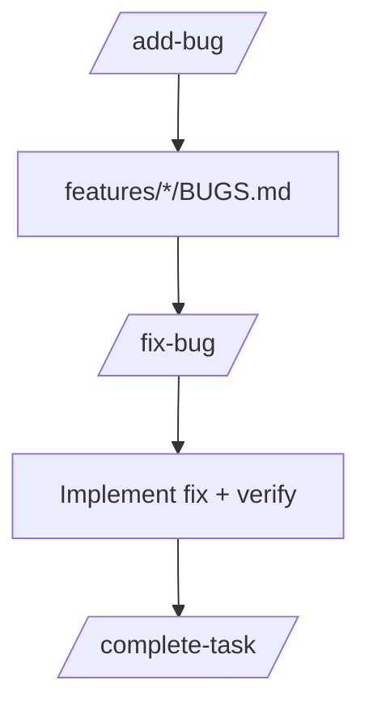
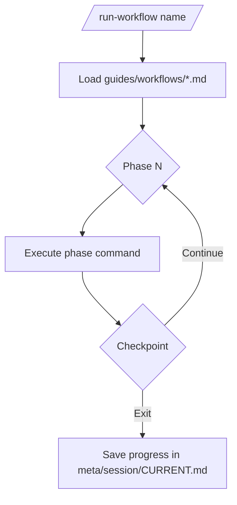
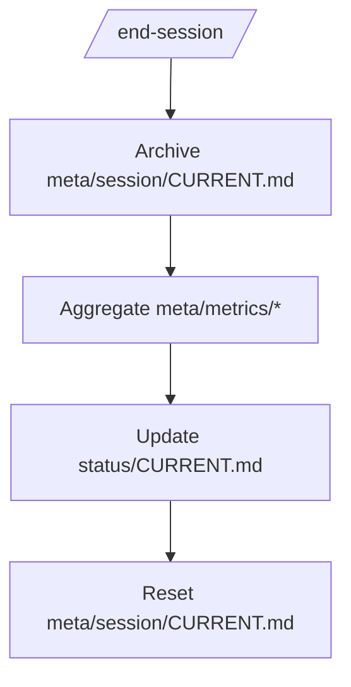

# Claude Workflow Audit Report (Quranalysis Mobile)

Date: 2026-01-24
Scope: .claude workflow system for Quranalysis-Mobile
Source folder: `cluade-code/Quranalysis-Mobile/Quranalysis-Mobile/.claude/`

## Executive Summary

This report summarizes the .claude command, agent, and meta workflows for the Quranalysis Mobile project. It maps data flow and file updates, provides mermaid diagrams per workflow, and highlights discrepancies and redundancies that can cause drift or double-counting.

Key observations:
- The workflow is comprehensive and modular, with strong separation between specs (`epics/`), runtime state (`status/`), and metrics (`meta/`).
- There are naming and structural mismatches that will cause inconsistent archives and task discovery.
- Agent workflows overlap with direct workflows, which can double-write metrics unless usage is tightly controlled.

## High-Level System Map

Primary workflow directories:
- `commands/`: executable workflow commands and loops
- `agents/`: agent types, dispatch rules, orchestration
- `guides/`: long-form usage and obscure workflows
- `status/`: single source of truth for current progress
- `epics/`: task specs and acceptance criteria
- `meta/`: session tracking, metrics, improvement backlog
- `standards/`, `learnings/`, `reference/`: guardrails and patterns

## Workflow Index

Common:
1) Direct implementation loop (`/start-epic` -> `/next-task` -> `/complete-task` -> `/end-session`)
2) Agent implementation loop (`/agent-dispatch` -> `/agent-complete`)
3) Research/spec/epic pipeline (`/research-tech` -> `/spec-feature` -> `/create-epic`)
4) Bug workflow (`/add-bug` -> `/fix-bug` -> `/complete-task`)

Obscure / Maintenance:
5) Run saved workflow (`/run-workflow`)
6) Refactor scan (`/refactor-check`)
7) Workflow improvement (`/improve-workflow`)
8) Ralph loop (automation only, no research)

## Mermaid Diagrams

### 1) Direct Implementation Loop

### 2) Agent Implementation Loop

### 3) Research -> Spec -> Epic Pipeline

### 4) Bug Workflow

### 5) Run Workflow (Saved)

### 6) End Session Aggregation

## Command -> File Updates (Concise)

| Command | Reads | Writes/Updates |
|---|---|---|
| `/start-session` | `meta/session/CURRENT.md`, `status/CURRENT.md` | `meta/session/archived/*` or `meta/session/archive/*`, reset `meta/session/CURRENT.md` |
| `/start-epic` | `status/CURRENT.md`, `epics/active/EPIC-*/README.md`, `learnings/*` | `meta/session/CURRENT.md`, `status/CURRENT.md` |
| `/next-task` | `status/CURRENT.md`, epic tasks, `BUGS.md` | `meta/session/CURRENT.md` (Active Task) |
| `/complete-task` | `meta/session/CURRENT.md` | git commit, `status/CURRENT.md`, epic `TASKS.md`, `meta/session/CURRENT.md`, `meta/metrics/*`, `learnings/*` |
| `/agent-dispatch` | epic task spec, `agents/DISPATCH.md`, standards | `meta/session/CURRENT.md` (Active Agents) |
| `/agent-complete` | agent report | git commit, `status/CURRENT.md`, `TASKS.md`, `meta/session/CURRENT.md`, `meta/metrics/*`, `learnings/*` |
| `/add-bug` | feature `BUGS.md` if exists | `BUGS.md`, epic README Blockers (sev 1-2), `meta/session/CURRENT.md` |
| `/fix-bug` | `BUGS.md`, `learnings/*` | `meta/session/CURRENT.md` (Active Bug Fix) |
| `/end-session` | `meta/session/CURRENT.md` | `meta/session/archive/*`, `meta/metrics/*`, `status/CURRENT.md`, reset `meta/session/CURRENT.md` |
| `/improve-workflow` | `meta/metrics/*`, `status/archive/*` | workflow docs, `meta/CHANGELOG.md` |

## Discrepancies and Redundancies

1) Archive folder name mismatch
- `/start-session` uses `meta/session/archived/*`
- `/end-session` uses `meta/session/archive/*`
- `.claude/README.md` references `meta/session/archive/*`
- Impact: split archives or failed archive lookup

2) Epic status mismatch
- `status/CURRENT.md` shows EPIC-4 complete
- `epics/active/EPIC-4-AI-CHAT/README.md` says "Not Started"
- Impact: conflicting source of truth for epic progress

3) Epic task structure mismatch
- `create-epic` template uses `FEATURE-N.X-*.md` with tasks inside
- EPIC-4 uses `features/*/TASKS.md` per feature
- EPIC-5 uses root `TASKS.md`
- Impact: `/start-epic` and `/next-task` may fail or require special-case logic

4) Bug completion overlap
- `/fix-bug` contains commit + metrics steps
- Also instructs using `/complete-task` for those same actions
- Impact: double commits or double metrics if both are followed

5) Agent vs direct completion overlap
- `/agent-complete` and `/complete-task` both update metrics/status
- Impact: double-counts if used for the same task

## Data Flow Observations (Potential Drift Points)

- `status/CURRENT.md` is the authoritative runtime state, but epic README status can drift unless updated as part of `/complete-task` or `/end-session`.
- `meta/session/CURRENT.md` is updated by multiple commands; if agent workflow and direct workflow are mixed, metrics can be duplicated.
- `meta/session/archive*` path mismatch risks breaking session history and downstream metrics aggregation.

## Audit Recommendations (Priority Order)

1) Normalize archive path: pick either `archive/` or `archived/` and update all references.
2) Standardize epic task structure: choose one canonical layout and update `/start-epic` and `/next-task` to match.
3) Remove overlap in bug completion: ensure `/fix-bug` defers commits/metrics to `/complete-task` only.
4) Define a single "completion route" per task: direct vs agent, never both.
5) Update EPIC-4 README status to match `status/CURRENT.md` if EPIC-4 is done.

## Appendix: Known Files Referenced

Key workflow files:
- `.claude/README.md`
- `.claude/commands/standard-loop/*`
- `.claude/commands/workflows/*`
- `.claude/agents/*`
- `.claude/guides/*`
- `.claude/status/CURRENT.md`
- `.claude/meta/session/CURRENT.md`
- `.claude/meta/metrics/*`

